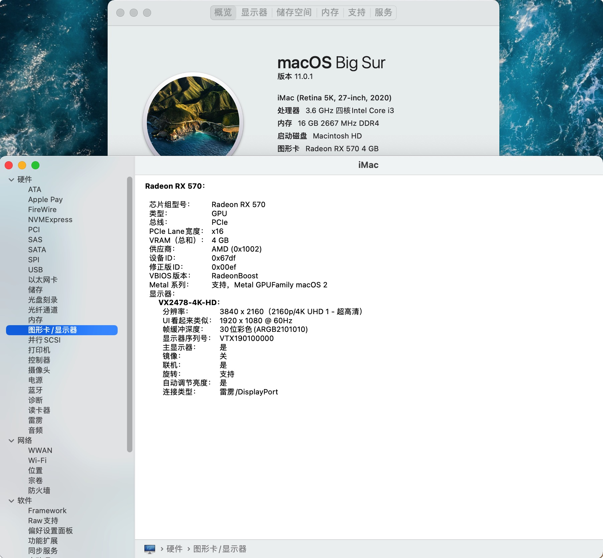
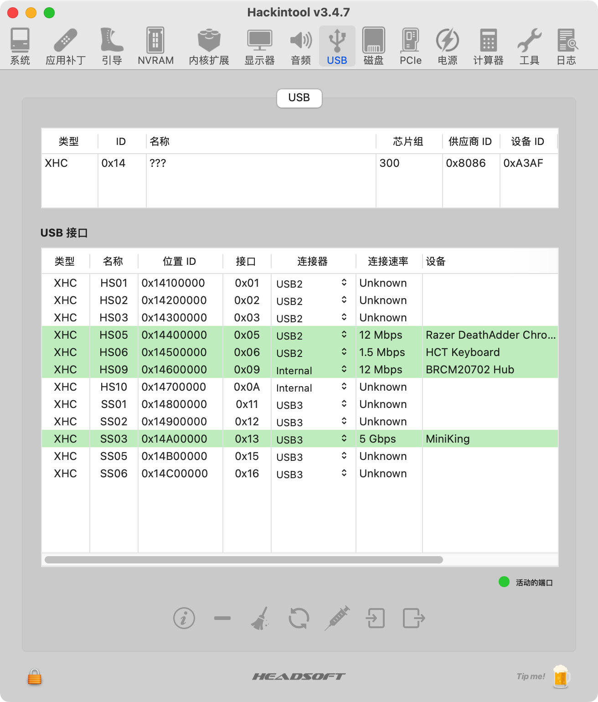

# ASRock-B460M-ITX-ac-Hackintosh

# [中文版](README.md)｜English

## Detail of my computer

| Specifications |                            Detail                            |
| :------------: | :----------------------------------------------------------: |
|      M/B       |                     ASRock-B460M-ITX/ac                      |
|     System     | macOS Catalina 10.15.x / Windows10 (Boot Camp) / macOS Big Sur 11 Beta |
|      CPU       |                 Intel Core i3 - 10100(4C8T)                  |
|     Memory     |                      2*8GB DDR4 2666MHz                      |
|      SSD       |                        Samsung 970EVO                        |
|    Graphics    |          AMD Radeon RX570 / Intel UHD Graphics 620           |
|    Monitor     |                    ViewSonic VX2478-4K-HD                    |
|     Audio      |                Realtek ALC887  AppleALC ID=21                |
| Wireless Card  |                         BCM94360CS2                          |
|      Case      |                         METALFISH S3                         |

## Situation of EFI

- `OpenCore`   OpenCore' s version is 0.6.3, It's base on the [Acidanthera](https://github.com/acidanthera)'s offical [Release](https://github.com/acidanthera/OpenCorePkg/releases), theoretically I will update to the latest version of OC in a week after it is released.

- `EFI-iGPU` used when the Desktop iGPU is used to drive a display.

- `EFI-dGPU` used when the Desktop iGPU is only used for computing tasks and doesn't drive a display. 

  - If you are using AMD RX500 series graphics CARDS (such as RX580, RX570, RX560, etc.), you can add the [`RadeonBoost.kext`](https://github.com/WenvyG/ASRock-B460M-ITX-ac-Hackintosh/tree/main/RadeonBoost.kext) in `EFI` --`OC`--`Kexts`, which will theoretically make the graphics card perform better. **And it can be used normally without it.**
  - If you are using Navi core RX5000 series graphics CARDS (such as RX5700(XT), RX5600(XT), RX5500(XT)), you need to include the **agdpmod=pikera** parameter under `NVRAM`-- `Add`--`7C436110-AB2A-4BBB-A880-FE41995C9F82`--`boot-args` to prevent the screen from going black during boot.

  ##### PS. 

  ##### 1. `OC 0.6.3 now is support to install macOS Big Sur to your disk, it's a good news for Hackintosh. Enjoy it!`

  #### 2. I prefer to use [`ProperTree`](https://github.com/corpnewt/ProperTree) when you are editing config.plist.

- ### BIOS Settings
  
  #### Enable 
  
  - `XHCI Hand Off`
  - `Above 4GB Decoding`
  
  ####  Disable
  
  - `Secure Boot` 
  - `CSM`
  - `CFG Lock` (recommended)
  - `VT-d`
  
- ### EFI
  
  - [Releases](https://github.com/WenvyG/ASRock-B460M-ITX-ac-Hackintosh/releases)

  ### Changelog
  
  - [Changelog](Changelog.md)

## What works:

- Intel UHD Graphins 620
- AMD Radeon RX570
- Wi-Fi and Bluetooth（using `BCM94360CS2`）
- Monitor (Using [MonitorControl](https://github.com/MonitorControl/MonitorControl/releases))
- USB
- Audio
- Intel I219V12 PCI Express Gigabit Ethernet
- NVRAM

## What not woks

- This EFI may have many shortcomings. So if you have any Questions or Suggestions for improvement, please discuss with me in the [Issues](https://github.com/WenvyG/Lenovo-ideapad-110-15IKB-Hackintosh/issues) and [Pull requests](https://github.com/WenvyG/ASRock-B460M-ITX-ac-Hackintosh/pulls). I hope you and I can make it more and more perfect.

## Credits

- Thanks to [Apple](https://www.apple.com) for providing macOS
- Thanks to [Acidanthera](https://github.com/acidanthera)  for providing  [AppleALC](https://github.com/acidanthera/AppleALC), [Lilu](https://github.com/acidanthera/Lilu), [OpenCorePkg](https://github.com/acidanthera/OpenCorePkg), [VirtualSMC](https://github.com/acidanthera/VirtualSMC) and [WhateverGreen](https://github.com/acidanthera/WhateverGreen).
- Thanks to [corpnewt](https://github.com/corpnewt) providing [gibMacOS](https://github.com/corpnewt/gibMacOS) and [ProperTree](https://github.com/corpnewt/ProperTree).
- Thanks to [MonitorControl](https://github.com/MonitorControl/MonitorControl/releases).

# This README may be lacking in details and contains errors. If you have any questions, please feel free to ask me.

