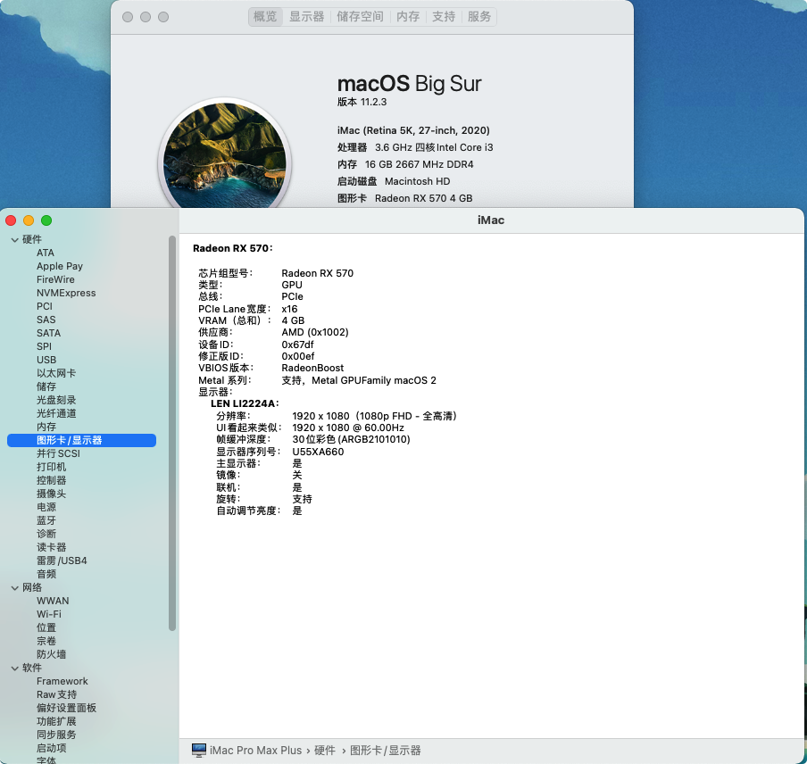

# 华擎-B460M-ITX-ac-Hackintosh

# 中文版｜[English]( README-EN.md)

## 电脑配置

|   规格   |                           详细信息                           |
| :------: | :----------------------------------------------------------: |
|   主板   |                      华擎 B460M-ITX/ac                       |
| 支持系统 | macOS Catalina 10.15.x （未测试）/ Windows 10（使用Boot Camp）/ macOS Big Sur 11 |
|  处理器  |                    英特尔 酷睿 i3 - 10100                    |
|   内存   |                   2*协徳 8GB DDR4 2666MHz                    |
|   硬盘   |                         三星 970EVO                          |
|   显卡   |       蓝宝石 Radeon RX570 4GB / Intel UHD Graphics 630       |
|  显示器  |                      优派 VX2478-4K-HD                       |
|   声卡   |                Realtek ALC887  AppleALC ID=12                |
|   网卡   |                      更换为BCM94360CS2                       |
|   机箱   |                           酷鱼 S3                            |

#### 

## 引导概况

#### `OpenCore`  OC目前版本0.6.4，基于[Acidanthera](https://github.com/acidanthera)官方[Release](https://github.com/acidanthera/OpenCorePkg/releases)，理论上在每月初官方版本OC新发布后，会在一周内跟进更新。

- `EFI-iGPU` 在机器只使用核显进行视频输出时使用。
  
- `EFI-dGPU` 在核显只用于计算，而视频输出由独显负责时使用，**此时核显不会具有视频输出功能。**

    - 如果你是在使用AMD RX500系列显卡的话（如RX580、RX570、RX560等），可以在`EFI` --`OC`--`Kexts`下加入[`RadeonBoost.kext`](https://github.com/WenvyG/ASRock-B460M-ITX-ac-Hackintosh/tree/main/RadeonBoost.kext)，理论上会有更好的性能表现。**不加也可以正常使用**。
    - 如果你在使用Navi核心的RX5000系列显卡（如RX5700(XT)、RX5600(XT)、RX5500(XT)），需要在`config.plist`的`NVRAM`-- `Add`--`7C436110-AB2A-4BBB-A880-FE41995C9F82`--`boot-args`中加入**agdpmod=pikera**，以防止在启动过程中黑屏。

    ##### 注：

    - **`新版OC 0.6.4已经支持安装最新版macOS Big Sur。`**

    - **编辑config.plist时推荐使用[`ProperTree`](https://github.com/corpnewt/ProperTree)。** Xcode在编辑DATA类型时会有问题；OpenCore Configurator更新不及时且不时会有BUG，可能会损换文件结构；不推荐使用。

    - 2020.12.9  得益于`OC 0.6.4`版本对于macOS新特性的支持，现在可以在`设置--声音--启动时播放声音`选择是否在启动时播放Mac灵魂的`Duang~`

      

- ### 安装前准备

  - 开机按`F2`或`Del`进入`BIOS`

    - **`Disabled`:**

      `Secure Boot`

      `CSM`

      `CFGLock`

      `VT-d`

    - **`Enable`:**

      `XHCI Hand Off`

      `Above 4GB Decoding`
- `F10` 保存设置并重启
  
- ### 安装后操作

  - 安装好系统，进入系统
  - 找到`终端`执行一下：`sudo spctl --master-disable`以允许打开第三方应用。

- 镜像下载
  
  - 通过[[**黑果小兵的部落阁**] 的原版镜像](https://blog.daliansky.net/categories/下载/镜像/)
  - 使用[**gibMacOS**](https://github.com/corpnewt/gibMacOS)
  
- EFI下载
  
  - [Releases](https://github.com/WenvyG/ASRock-B460M-ITX-ac-Hackintosh)
  
- 更新日志  
  
  - [Changelog](Changelog.md)

## 正常工作

- Intel核心显卡 UHD630
- AMD Radeon RX570
- Wi-Fi与蓝牙（已将原装的高通网卡替换为`BCM94360CS2`）
- 显示器亮度调节（使用[MonitorControl](https://github.com/MonitorControl/MonitorControl/releases)）
- USB定制
- 声卡
- 有线网卡（Intel I219V12 PCI Express Gigabit Ethernet）
- `OpenCore`下`NVRAM`正常，可以使用`Boot Camp`在macOS和Windows10之间自由切换

## 不正常工作

- 这份EFI也许还有很多的不足，有任何问题或着改进建议都可以在[Issues](https://github.com/WenvyG/Lenovo-ideapad-110-15IKB-Hackintosh/issues)中跟我反馈或交流😊😊😊😊😊，希望大家可以让其越来越完美。

## 鸣谢

- 感谢[Apple](https://www.apple.com/cn/)的macOS
- 感谢 [Acidanthera](https://github.com/acidanthera) 提供 [AppleALC](https://github.com/acidanthera/AppleALC)，[Lilu](https://github.com/acidanthera/Lilu)，[OpenCorePkg](https://github.com/acidanthera/OpenCorePkg)，[VirtualSMC](https://github.com/acidanthera/VirtualSMC)，和 [WhateverGreen](https://github.com/acidanthera/WhateverGreen)。
- 感谢 [daliansky](https://github.com/daliansky) 提供[Apple macOS 镜像下载](https://blog.daliansky.net/categories/下载/镜像/)。
- 感谢[corpnewt](https://github.com/corpnewt)提供[gibMacOS](https://github.com/corpnewt/gibMacOS)和[ProperTree](https://github.com/corpnewt/ProperTree)
- 感谢[MonitorControl](https://github.com/MonitorControl/MonitorControl/releases)

# 注：

- **我所分享的EFI引导文件的目标人群是拥有一定黑苹果基础的的同配置用户，EFI中的三码已被我删除，需要手动填写属于你自己的**

